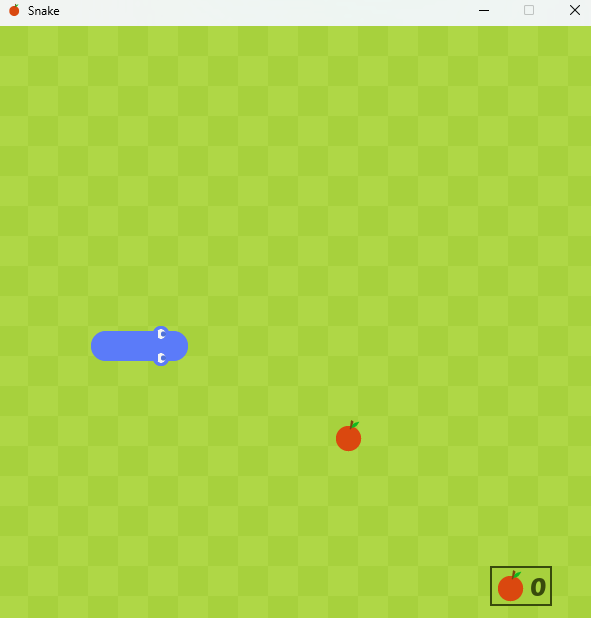
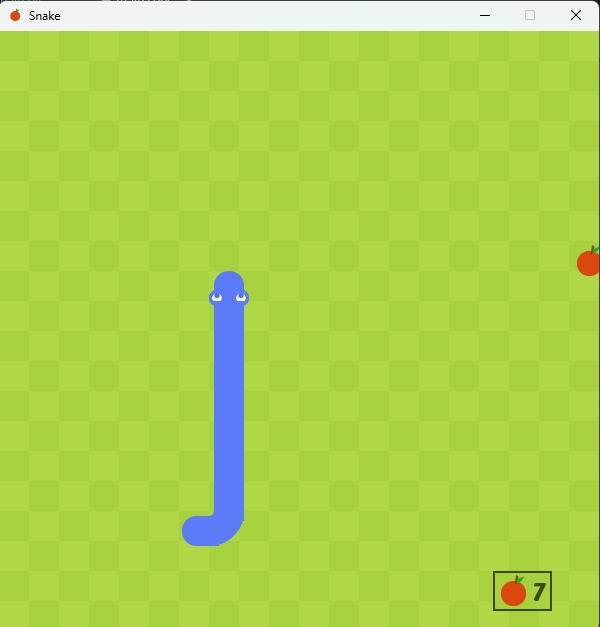

# 🐍 Snake 

A classic Snake game built with **Python** and **Pygame**.

## 🎮 Features

* Grid-based movement
* Sound effects
* Score tracking
* Custom graphics & font
* Packaged executable support (PyInstaller)

---

## 📦 Requirements

* Python 3.x
* Pygame

Install dependencies:

```bash
pip install pygame
```

---

## ▶️ Run the Game

```bash
python main.py
```

Use the arrow keys to move the snake.

---

## 🛠 Build Executable

This project includes a PyInstaller spec file.

Install PyInstaller:

```bash
pip install pyinstaller
```

Build:

```bash
pyinstaller main.spec
```

The executable will be inside the `dist/` folder.

---

## 📁 Project Structure

```
Snake/
│── main.py
│── main.spec
│── Graphics/
│── Sound/
│── Font/
│── screenshot/
```

---

## 📸 Screenshots




